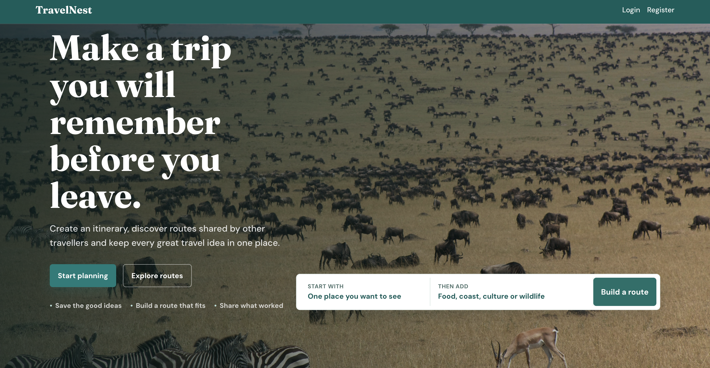
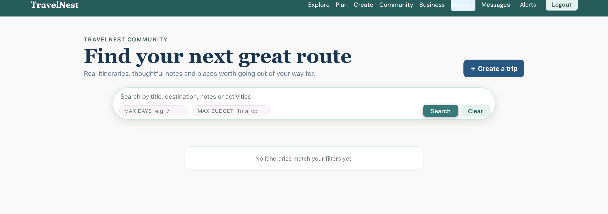
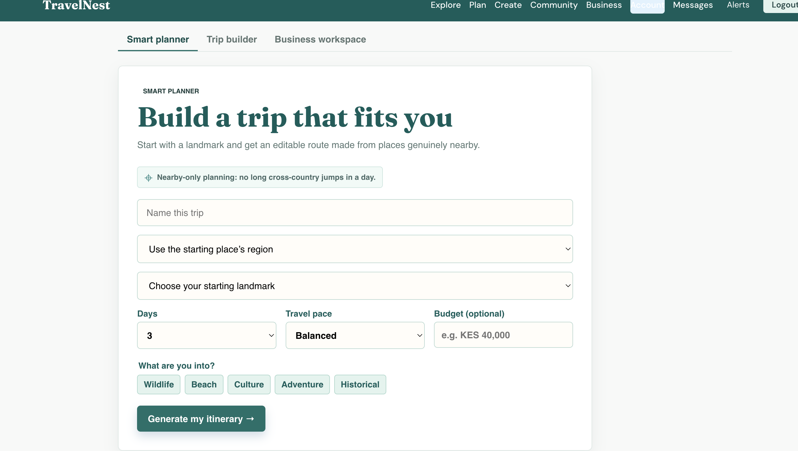

# TravelNest

TravelNest is a travel-planning and community platform for discovering Kenyan experiences, building itineraries, sharing routes, and connecting with other travellers.

It includes an itinerary planner, social travel feed, messaging, profiles, business listings, moderation tools, and email-based account verification.

## Live demo

- Website: https://travelnestapp.vercel.app/
- API health check: https://travelnest-api-oi5o.onrender.com/

The React frontend is deployed on Vercel, the Express API is hosted on Render, and production data is stored in MongoDB Atlas.

## Screenshots

Add screenshots to `docs/screenshots/` using these filenames:







## Features

- Create, edit, save, and share itineraries
- Smart Planner that builds routes from nearby places and travel pace
- Kenya region support: Coast, Nairobi, Rift Valley, Central, Western, and Southern Safari
- Community profiles, follows, messages, likes, saves, comments, and notifications
- SME Portal for verified businesses to submit travel listings
- Admin review queues for business applications, listings, and traveller place suggestions
- Email verification and password reset flows

## Technology

- Frontend: React (Create React App)
- Backend: Node.js, Express, MongoDB, Mongoose
- Authentication: JWT and bcrypt
- File uploads: Multer
- Email: Nodemailer via SMTP

## Local setup

### 1. Install dependencies

```bash
cd backend
npm install

cd ../frontendd
npm install
```

### 2. Configure environment variables

Copy the example environment file:

```bash
cd backend
cp .env.example .env
```

Set at least the following in `backend/.env`:

```env
MONGO_URI=mongodb://127.0.0.1:27017/travelnest
JWT_SECRET=replace-with-a-long-random-secret
PORT=3001
CLIENT_URL=http://localhost:3000
```

### 3. Start MongoDB locally

On macOS with Homebrew:

```bash
brew services start mongodb-community@8.0
```

### 4. Start the app

Run these in separate terminals:

```bash
cd backend
npm run dev
```

```bash
cd frontendd
npm start
```

The frontend runs at `http://localhost:3000` and the API runs at `http://localhost:3001`.

## Seed Kenya travel places

To add the starter set of Kenyan attractions to an empty database:

```bash
cd backend
npm run seed
```

> Warning: the seed command replaces the existing attraction collection.

## Email setup

Email verification and reset delivery are temporarily disabled by default so the app can be demonstrated without SMTP. Set `REQUIRE_EMAIL_VERIFICATION=true` and `DIRECT_PASSWORD_RESET=false` when you are ready to enable the email flow below.

TravelNest sends verification and password-reset emails through SMTP. Add these values to `backend/.env`:

```env
SMTP_HOST=smtp.gmail.com
SMTP_PORT=587
SMTP_SECURE=false
SMTP_USER=your-gmail@gmail.com
SMTP_PASS=your-gmail-app-password
MAIL_FROM="TravelNest <your-gmail@gmail.com>"
```

For Gmail, use a Google App Password rather than your normal Gmail password. When SMTP is not configured, development links are returned in the UI and written to the backend console.

## Roles and moderation

There are three roles:

- `traveller`: plans and shares trips
- `business`: can request verified business access and submit listings
- `admin`: reviews business access, listings, and traveller suggestions

To make an existing user an admin locally:

```javascript
use travelnest
db.users.updateOne(
  { email: "your-email@example.com" },
  { $set: { role: "admin" } }
)
```

Run this from `mongosh`.

## Smart Planner behaviour

The planner uses the selected starting landmark as its primary location signal. It:

- keeps places in the selected or inferred Kenya region
- prefers the chosen interests, but falls back to relevant nearby highlights when necessary
- limits distance by pace: relaxed 70 km, balanced 100 km, packed 125 km
- removes duplicate landmarks and orders stops to minimise backtracking

## Production checklist

Before deploying:

- Use MongoDB Atlas instead of a local MongoDB instance
- Set production `MONGO_URI`, `JWT_SECRET`, `CLIENT_URL`, and SMTP variables
- Replace local API URLs with an environment-based frontend API URL
- Configure CORS to allow only your frontend domain
- Test registration, email verification, password reset, itinerary creation, messages, and the SME review flow
- Build the frontend with `npm run build`

For a typical deployment, host the React frontend on Vercel or Netlify and the Express API on Render or Railway.

## Deploy on Vercel and Render

1. Create a MongoDB Atlas database and add its connection string as `MONGO_URI` in Render.
2. Create a Render Web Service using `backend` as the root directory, `npm ci` as the build command, and `npm start` as the start command. Set `CLIENT_URL` to `https://travelnestapp.vercel.app` and fill in the SMTP values before allowing public registrations.
3. Create a Vercel project with `frontendd` as its root directory. Add `REACT_APP_API_URL=https://travelnest-api-oi5o.onrender.com` and redeploy after setting it.
4. For preview deployments, separate permitted origins in Render's `CLIENT_URL` value with commas.

The frontend reads `REACT_APP_API_URL` at build time. The default remains `http://localhost:3001` for local development.

## Project structure

```text
travelnestapp/
├── backend/      # Express API, MongoDB models, auth and planner logic
├── frontendd/    # React user interface
└── README.md
```
